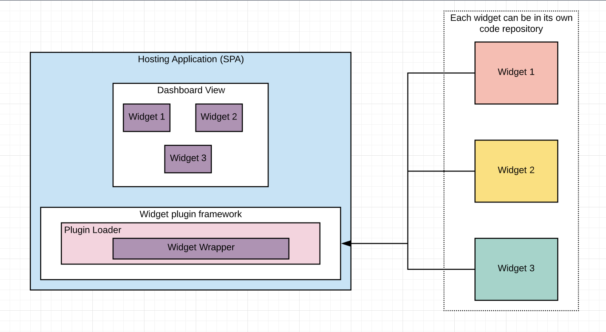
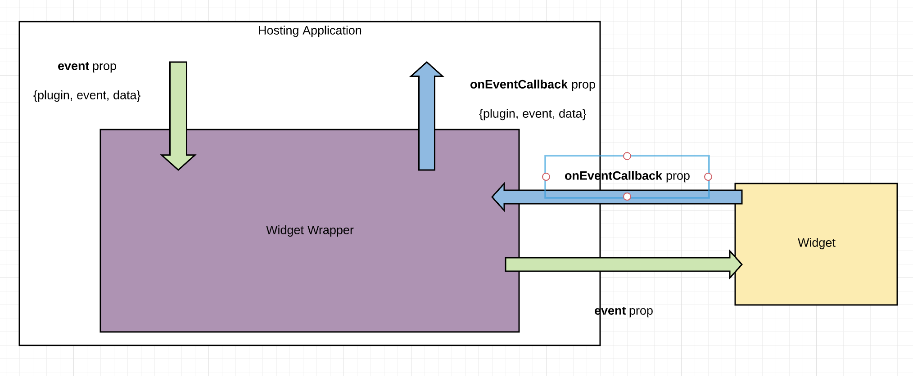

This project was bootstrapped with [Create React App](https://github.com/facebook/create-react-app).

## Available Scripts

In the project directory, you can run:

### `yarn start`

Runs the app in the development mode. 
Open [http://localhost:3000](http://localhost:3000) to view it in the browser.

The page will reload if you make edits. 
You will also see any lint errors in the console.

### `yarn test`

Launches the test runner in the interactive watch mode. 
See the section about [running tests](https://facebook.github.io/create-react-app/docs/running-tests) for more information.

### `yarn build`

Builds the app for production to the `build` folder. 
It correctly bundles React in production mode and optimizes the build for the best performance.

The build is minified and the filenames include the hashes. 
Your app is ready to be deployed!

See the section about [deployment](https://facebook.github.io/create-react-app/docs/deployment) for more information.

### `yarn eject`

**Note: this is a one-way operation. Once you `eject`, you can’t go back!**

If you aren’t satisfied with the build tool and configuration choices, you can `eject` at any time. This command will remove the single build dependency from your project.

Instead, it will copy all the configuration files and the transitive dependencies (webpack, Babel, ESLint, etc) right into your project so you have full control over them. All of the commands except `eject` will still work, but they will point to the copied scripts so you can tweak them. At this point you’re on your own.

You don’t have to ever use `eject`. The curated feature set is suitable for small and middle deployments, and you shouldn’t feel obligated to use this feature. However we understand that this tool wouldn’t be useful if you couldn’t customize it when you are ready for it.

## Learn More

You can learn more in the [Create React App documentation](https://facebook.github.io/create-react-app/docs/getting-started).

To learn React, check out the [React documentation](https://reactjs.org/).

### Code Splitting

This section has moved here: https://facebook.github.io/create-react-app/docs/code-splitting

### Analyzing the Bundle Size

This section has moved here: https://facebook.github.io/create-react-app/docs/analyzing-the-bundle-size

### Making a Progressive Web App

This section has moved here: https://facebook.github.io/create-react-app/docs/making-a-progressive-web-app

### Advanced Configuration

This section has moved here: https://facebook.github.io/create-react-app/docs/advanced-configuration

### Deployment

This section has moved here: https://facebook.github.io/create-react-app/docs/deployment

### `yarn build` fails to minify

This section has moved here: https://facebook.github.io/create-react-app/docs/troubleshooting#npm-run-build-fails-to-minify

## Widget Framework

This section describes how the widget framework works.

The purpose of this framework is to be able to use any UI widget developed according to the widget specification to create a new UI view like a Dashboard.

The widgets are registered as plugins and then wrapped with a higher order component that provides event handling between the container and the widget itself. This wrapper then gets rendered in the application.

It supports configuration of multiple such widgets as plugins, currently maintained as a plugin configuration file. But this can be enhanced to have the plugins as independent repositories and then pull them via the node modules to create the relevant configuration file.

The diagram below describes how it all works:

### Event handling

The communication between the container and the widget is handled by the widget wrapper by passing in relevant component props to the widget.

There are two props `event` and `onEventComplete`

`event`

- The event prop contains details about the plugin to which the event needs to be sent along with the event information and any data that needs to be passed to the widget
- The plugin information contains the id, name of the plugin, type of the plugin to enable the place where the plugin (widget) needs to be rendered and the entry file
- The event object contains the event id as well as the event name. The event name can be one of the following `SAVE`, `NEXT_PAGE` and `PREVIOUS_PAGE`. This is extensible. The current set is only for POC purpose
- The data object can be any data that the container wants to send to the widget

`onEventComplete`

- The onEventComplete callback prop is called by the widget whenever the operation corresponding to the event is completed
- The callback parameter again contains the plugin, event and data information if any
- The plugin information contains the id, name of the plugin, type of the plugin to enable the place where the plugin (widget) needs to be rendered and the entry file
- The event object contains the event id as well as the event name. The event name can be one of the following `SAVE`, `NEXT_PAGE` and `PREVIOUS_PAGE`. This is extensible. The current set is only for POC purpose
- The data object can be any data that the widget wants to send back to the container

